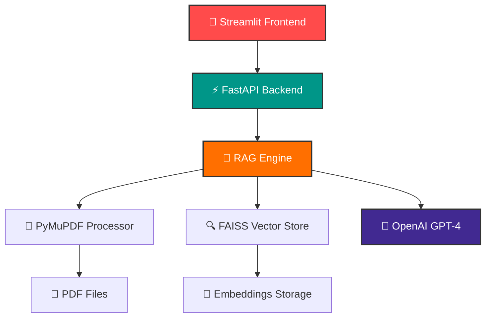

## ☁️ Déploiement Render (Cloud)

Le projet est prêt pour un déploiement **ultra-simple** sur [Render](https://render.com) :

1. **Poussez le repo sur GitHub**
2. **Créez un service web Python sur Render**
3. **Render détecte automatiquement** :
   - `requirements.txt`
   - `Procfile`
   - `app.py`
4. **Ajoutez la variable d'environnement** `GOOGLE_API_KEY` dans les settings Render

> Voir le guide complet : [RENDER.md](RENDER.md)

Après déploiement, accédez à votre assistant sur l'URL Render fournie !


# RAG PDF Assistant

> Assistant IA pour interroger vos documents PDF avec RAG (Retrieval-Augmented Generation) utilisant Streamlit, Gemini (Google), FAISS et pypdf.


---

## 🚀 À propos

Ce projet RAG (Retrieval-Augmented Generation) permet d'interroger des documents PDF en langage naturel grâce à l'intelligence artificielle. Il utilise une architecture **tout-en-un** basée sur Streamlit, Gemini (Google), FAISS et pypdf, optimisée pour un déploiement simple (notamment sur Render).

## ✨ Fonctionnalités

- **📤 Upload PDF intelligent** : Extraction robuste via pypdf
- **🎨 Interface Streamlit** : Web app moderne, drag & drop
- **🧠 RAG Gemini** : IA Google Gemini (API clé requise)
- **🔍 Vectorisation FAISS** : Recherche sémantique rapide
- **📊 Métriques en temps réel** : Chunks, caractères, sources
- **🛡️ Gestion d'erreurs** : Validation et feedback utilisateur
- **💾 Zéro backend séparé** : Tout dans `app.py` (pas de FastAPI)

## 🛠️ Stack Technique

### Application principale


### AI & Machine Learning


### PDF & Traitement


### Processing & Storage


---

## 🏗️ Architecture




### 📁 Structure du Projet

```
rag-psdf-assistant/
├── app.py               # Application Streamlit tout-en-un
├── requirements.txt     # Dépendances Python
├── requirements-minimal.txt # Dépendances ultra-légères (Render)
├── Procfile             # Commande de démarrage (Render)
├── .env.example         # Variables d'environnement exemple
├── README.md            # Documentation principale
├── RENDER.md            # Guide déploiement Render
```

> **Note :** Pas de backend séparé, tout est dans `app.py`. Les fichiers PDF uploadés et les embeddings sont temporaires (pas de persistance longue durée).


## 📦 Installation & Démarrage

### ⚡ Démarrage rapide

1. **📋 Prérequis**
   ```bash
   # Vérifiez votre version Python (3.8+ requis)
   python --version
   # Obtenez une clé API Gemini (Google AI)
   # https://aistudio.google.com/app/apikey
   ```

2. **📥 Installation des dépendances**
   ```bash
   pip install -r requirements.txt
   ```

3. **🔑 Configuration**
   ```bash
   # Copier le fichier d'exemple puis éditer
   cp .env.example .env  # Linux/Mac
   copy .env.example .env  # Windows
   # Ouvrir .env et renseigner GOOGLE_API_KEY
   ```

4. **🚀 Lancement de l'application**
   ```bash
   streamlit run app.py
   ```

5. **🌐 Accès à l'interface**
   - **Application** : http://localhost:8501

---

## 📖 Guide d'utilisation

### 🎯 Workflow complet

1. **🌐 Accéder à l'application**
   - Ouvrez http://localhost:8501 dans votre navigateur

2. **📤 Upload de documents**
   - Utilisez la zone de drag & drop ou cliquez "Browse files"
   - Sélectionnez vos fichiers PDF
   - Attendez la confirmation "✅ PDF ingéré avec succès"

3. **💬 Poser des questions**
   - Saisissez votre question dans le chat
   - L'IA analysera les documents uploadés
   - Recevez une réponse avec les sources citées

4. **📊 Suivre les métriques**
   - Nombre de chunks traités
   - Nombre de caractères indexés  
   - Liste des fichiers disponibles


### 🛠️ Utilisation

Tout se fait via l'interface web Streamlit :

1. **Upload PDF** : Glissez-déposez ou sélectionnez un fichier PDF.
2. **Indexation** : Le document est découpé, vectorisé et prêt à l'interrogation.
3. **Posez vos questions** : Entrez une question, l'IA Gemini répond en citant le contexte extrait du PDF.
4. **Métriques** : Visualisez le nombre de chunks, caractères, et le nom du fichier traité.

> **Pas d'API REST** : Toutes les interactions se font via l'interface utilisateur Streamlit (http://localhost:8501).


## 🚨 Dépannage

### 🔑 Problèmes d'API Key OpenAI
```bash
# ❌ Erreur : "OpenAI API Key not found"
# ✅ Solution :
# 1. Vérifiez le fichier .env
cat .env

# 2. Redémarrez le backend après modification  
# 3. Testez la connexion : http://localhost:8000/health
```

### 🌐 Problèmes de port
```bash
# ❌ Port 8000/8501 déjà utilisé
# ✅ Solution :

# Tuer les processus existants
taskkill /f /im python.exe

# Ou modifier les ports dans les scripts
# Backend : uvicorn main:app --port 8001
# Frontend : streamlit run --server.port 8502
```

### 📄 Problèmes de PDF
```bash
# ❌ Erreur lors du processing PDF  
# ✅ Vérifications :
# - Taille < 10MB
# - Format PDF valide
# - Pas de protection par mot de passe
# - Contient du texte (pas uniquement images)
```

### 💾 Problèmes vectorstore
```bash
# ❌ Erreur FAISS ou vectorstore corrompu
# ✅ Solution : supprimer et recréer
rmdir /s vectorstore
# Réuploader vos PDFs
```

---

## 🤝 Contributing

Ce projet a été migré de Node.js vers Python pour de meilleures performances RAG.

### 📋 Roadmap

- [ ] Support multi-formats (DOCX, TXT)
- [ ] Interface chat avancée avec historique  
- [ ] Déploiement Docker
- [ ] Support GPU pour FAISS
- [ ] API de gestion des utilisateurs
- [ ] Métriques de performance détaillées

### 🛠️ Développement

```bash
# Mode développement avec auto-reload
cd backend
uvicorn main:app --reload --port 8000

cd frontend  
streamlit run streamlit_app.py --server.port 8501
```

---

## 📄 Licence

MIT License - Voir [LICENSE](LICENSE) pour plus de détails.

---

## 📞 Support

- 🐛 **Issues :** [GitHub Issues](https://github.com/votre-repo/rag-psdf-assistant/issues)
- 📧 **Email :** support@votre-domaine.com
- 📖 **Documentation :** [Wiki complet](https://github.com/votre-repo/rag-psdf-assistant/wiki)

### Erreur de dépendances
```bash
# Réinstaller les dépendances
pip install --upgrade -r requirements.txt
```

### Port déjà utilisé
```bash
# Changer le port dans le code ou tuer le processus
lsof -ti:8000 | xargs kill -9  # Linux/Mac
netstat -ano | findstr :8000   # Windows
```

## 🎯 Avantages vs Version Node.js

| Feature | Node.js | Python |
|---------|---------|--------|
| **PDF Parsing** | ❌ Problèmes DOMMatrix | ✅ PyMuPDF robuste |
| **LangChain** | 🟡 Fonctionnalités limitées | ✅ Écosystème complet |
| **AI/ML Ecosystem** | ❌ Limité | ✅ NumPy, pandas, sklearn |
| **Performance RAG** | 🟡 Correct | ✅ Optimisé |
| **Documentation** | 🟡 Moins d'exemples | ✅ Communauté active |

## 📈 Améliorations futures

- [ ] **Multi-documents** : Support de plusieurs PDFs simultanément
- [ ] **Base de données** : PostgreSQL avec pgvector
- [ ] **Authentification** : Gestion des utilisateurs
- [ ] **Docker** : Containerisation complète
- [ ] **Monitoring** : Logs et métriques
- [ ] **Tests** : Suite de tests automatisés

## 📄 Licence

MIT

## 🤝 Contribution

Les contributions sont les bienvenues ! Ouvrez une issue ou une pull request.

---

**Profitez de votre assistant RAG PDF plus robuste ! 🎉**