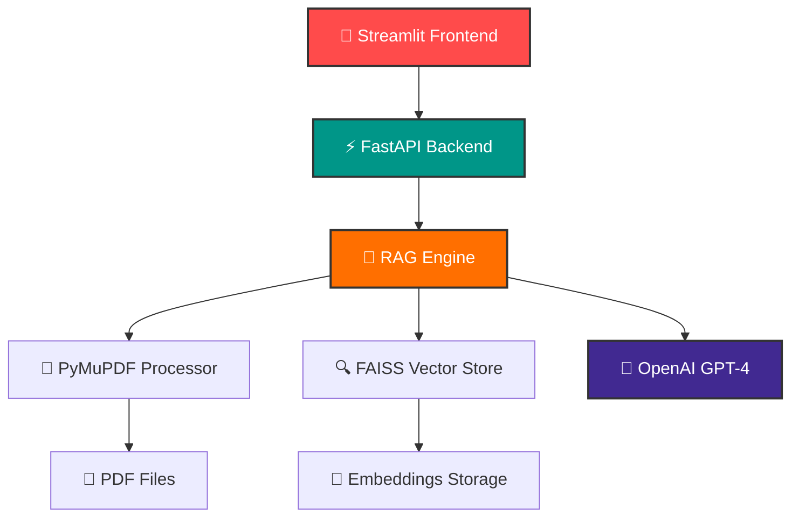

# RAG PDF Assistant

> Assistant IA pour interroger vos documents PDF avec RAG (Retrieval-Augmented Generation) utilisant FastAPI, LangChain et Streamlit.


---

## 🚀 À propos

Ce projet RAG (Retrieval-Augmented Generation) permet d'interroger des documents PDF en langage naturel grâce à l'intelligence artificielle. Migré de Node.js vers Python pour bénéficier d'un écosystème AI/ML plus mature et d'une meilleure compatibilité avec les librairies de traitement PDF.

## ✨ Fonctionnalités

- **📤 Upload PDF intelligent** : Support robuste des PDFs via PyMuPDF (fitz)
- **⚡ API FastAPI** : Backend performant avec documentation automatique Swagger
- **🎨 Interface Streamlit** : Interface web intuitive avec upload drag & drop
- **🧠 RAG avancé** : LangChain avec récupération de contexte intelligent
- **🔍 Vectorisation FAISS** : Stockage et recherche vectorielle optimisée
- **📊 Métriques en temps réel** : Suivi des chunks, caractères et sources
- **🛡️ Gestion d'erreurs** : Système complet de validation et logging
- **🗂️ Historique des fichiers** : Gestion et visualisation des PDFs uploadés

## 🛠️ Stack Technique

### Backend & API


### AI & Machine Learning  


### Frontend & Interface


### Processing & Storage


---

## 🏗️ Architecture



### 📁 Structure du Projet

```
rag-psdf-assistant/
├── 🚀 backend/              # Serveur FastAPI
│   ├── main.py             # Points d'entrée API
│   └── rag_engine.py       # Logique RAG core
├── 🎨 frontend/             # Interface Streamlit 
│   └── streamlit_app.py    # Application principale
├── 📂 uploads/              # Stockage PDFs (auto-créé)
├── 🧮 vectorstore/          # Base vectorielle FAISS (auto-créé)
├── 📋 requirements.txt      # Dépendances Python
├── 🔧 start_backend.bat     # Script démarrage backend
├── 🎯 start_frontend.bat    # Script démarrage frontend
└── 📝 .env.example         # Template configuration
```

## 📦 Installation & Démarrage

### ⚡ Démarrage rapide

1. **📋 Prérequis**
   ```bash
   # Vérifiez votre version Python (3.8+ requis)
   python --version
   
   # Préparez votre clé OpenAI
   # Obtenez-la sur : https://platform.openai.com/api-keys
   ```

2. **📥 Installation des dépendances**
   ```bash
   pip install -r requirements.txt
   ```

3. **🔑 Configuration**
   ```bash
   # Windows
   copy .env.example .env
   
   # Linux/Mac  
   cp .env.example .env
   
   # Éditer .env avec votre éditeur préféré
   # OPENAI_API_KEY=sk-your-openai-api-key-here
   ```

4. **🚀 Lancement des serveurs**

   **🎯 Option A : Scripts automatiques (Windows)**
   ```bash
   # Démarrer le backend FastAPI
   start_backend.bat
   
   # Dans un nouveau terminal : démarrer le frontend Streamlit
   start_frontend.bat
   ```
   
   **⚙️ Option B : Démarrage manuel**
   ```bash
   # Terminal 1 - Backend
   cd backend
   python main.py
   
   # Terminal 2 - Frontend  
   cd frontend
   streamlit run streamlit_app.py
   ```

5. **🌐 Accès aux interfaces**
   - **Frontend Streamlit** : http://localhost:8501
   - **API Documentation** : http://localhost:8000/docs
   - **Health Check** : http://localhost:8000/health

---

## 📖 Guide d'utilisation

### 🎯 Workflow complet

1. **🌐 Accéder à l'application**
   - Ouvrez http://localhost:8501 dans votre navigateur

2. **📤 Upload de documents**
   - Utilisez la zone de drag & drop ou cliquez "Browse files"
   - Sélectionnez vos fichiers PDF
   - Attendez la confirmation "✅ PDF ingéré avec succès"

3. **💬 Poser des questions**
   - Saisissez votre question dans le chat
   - L'IA analysera les documents uploadés
   - Recevez une réponse avec les sources citées

4. **📊 Suivre les métriques**
   - Nombre de chunks traités
   - Nombre de caractères indexés  
   - Liste des fichiers disponibles

### 🛠️ API Endpoints

| Endpoint | Méthode | Description |
|----------|---------|-------------|
| `/health` | GET | Status de l'API |
| `/upload` | POST | Upload et indexation PDF |
| `/ask` | POST | Question-réponse RAG |
| `/files` | GET | Liste des fichiers indexés |

📋 **Documentation complète** : http://localhost:8000/docs
---

## 🚨 Dépannage

### 🔑 Problèmes d'API Key OpenAI
```bash
# ❌ Erreur : "OpenAI API Key not found"
# ✅ Solution :
# 1. Vérifiez le fichier .env
cat .env

# 2. Redémarrez le backend après modification  
# 3. Testez la connexion : http://localhost:8000/health
```

### 🌐 Problèmes de port
```bash
# ❌ Port 8000/8501 déjà utilisé
# ✅ Solution :

# Tuer les processus existants
taskkill /f /im python.exe

# Ou modifier les ports dans les scripts
# Backend : uvicorn main:app --port 8001
# Frontend : streamlit run --server.port 8502
```

### 📄 Problèmes de PDF
```bash
# ❌ Erreur lors du processing PDF  
# ✅ Vérifications :
# - Taille < 10MB
# - Format PDF valide
# - Pas de protection par mot de passe
# - Contient du texte (pas uniquement images)
```

### 💾 Problèmes vectorstore
```bash
# ❌ Erreur FAISS ou vectorstore corrompu
# ✅ Solution : supprimer et recréer
rmdir /s vectorstore
# Réuploader vos PDFs
```

---

## 🤝 Contributing

Ce projet a été migré de Node.js vers Python pour de meilleures performances RAG.

### 📋 Roadmap

- [ ] Support multi-formats (DOCX, TXT)
- [ ] Interface chat avancée avec historique  
- [ ] Déploiement Docker
- [ ] Support GPU pour FAISS
- [ ] API de gestion des utilisateurs
- [ ] Métriques de performance détaillées

### 🛠️ Développement

```bash
# Mode développement avec auto-reload
cd backend
uvicorn main:app --reload --port 8000

cd frontend  
streamlit run streamlit_app.py --server.port 8501
```

---

## 📄 Licence

MIT License - Voir [LICENSE](LICENSE) pour plus de détails.

---

## 📞 Support

- 🐛 **Issues :** [GitHub Issues](https://github.com/votre-repo/rag-psdf-assistant/issues)
- 📧 **Email :** support@votre-domaine.com
- 📖 **Documentation :** [Wiki complet](https://github.com/votre-repo/rag-psdf-assistant/wiki)

### Erreur de dépendances
```bash
# Réinstaller les dépendances
pip install --upgrade -r requirements.txt
```

### Port déjà utilisé
```bash
# Changer le port dans le code ou tuer le processus
lsof -ti:8000 | xargs kill -9  # Linux/Mac
netstat -ano | findstr :8000   # Windows
```

## 🎯 Avantages vs Version Node.js

| Feature | Node.js | Python |
|---------|---------|--------|
| **PDF Parsing** | ❌ Problèmes DOMMatrix | ✅ PyMuPDF robuste |
| **LangChain** | 🟡 Fonctionnalités limitées | ✅ Écosystème complet |
| **AI/ML Ecosystem** | ❌ Limité | ✅ NumPy, pandas, sklearn |
| **Performance RAG** | 🟡 Correct | ✅ Optimisé |
| **Documentation** | 🟡 Moins d'exemples | ✅ Communauté active |

## 📈 Améliorations futures

- [ ] **Multi-documents** : Support de plusieurs PDFs simultanément
- [ ] **Base de données** : PostgreSQL avec pgvector
- [ ] **Authentification** : Gestion des utilisateurs
- [ ] **Docker** : Containerisation complète
- [ ] **Monitoring** : Logs et métriques
- [ ] **Tests** : Suite de tests automatisés

## 📄 Licence

MIT

## 🤝 Contribution

Les contributions sont les bienvenues ! Ouvrez une issue ou une pull request.

---

**Profitez de votre assistant RAG PDF plus robuste ! 🎉**